## Mission Details

You will explore the Webex Campaign User Interface and understand how to configure its key components, including business days, contact modes, DNC lists, suppression rules, telephony outcomes, and more. These configurations will help you implement and optimize a Campaign Voice Flow effectively.

## Featurs Overview.

### Task 1 Create new Google Profile

1. Currently, users with aliases are not allowed to log in to the new Campaign Management portal. Engineering is working to resolve this issue. However, for this lab, we will all be using one user account (wxcclabscx@gmail.com). Since you are already using the default Chrome profile to log in to Control Hub, you will need to create an additional Chrome profile to log in to the Campaign Management portal.

2. Open up Google Chrome and on the right top sides click on the profiles and then click on **Add Chrome Profile**.
   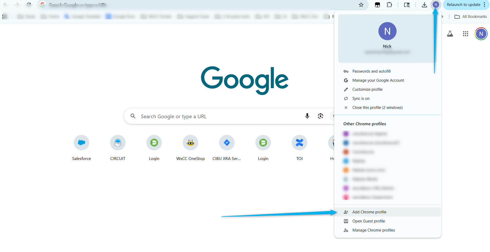 

3. Select **Continue without an account**.
    

4. Name your profile, for example, **Webex Campaign** and click **Done**. 

   

### Task 2 [OVERVIEW ONLY]. Explore the Webex Campaign User Interface.

1. Using the following user name and the password (**wxcclabscx@gmail.com/TSSumm!t_2024!$%**) login to the portal  [Campaign Manager](https://traininglab.wxcc.webexcampaign.us/nextgen/){:target="_blank"}

2. You will see a welcome message along with a list of required configurations that need to be completed to set up the Campaign Voice Flow. Click on Got it. 
   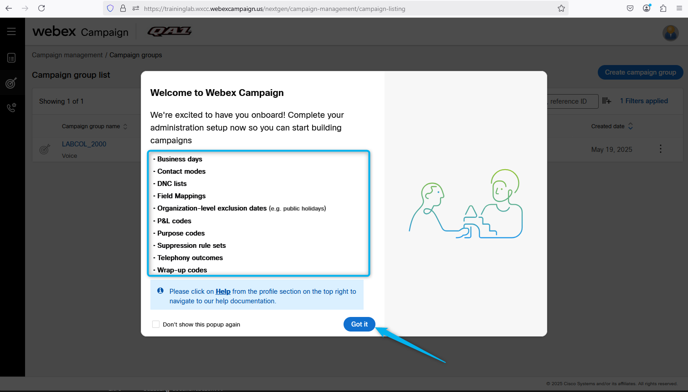 

3. Navitate to **Voice campaigns administration** module.
   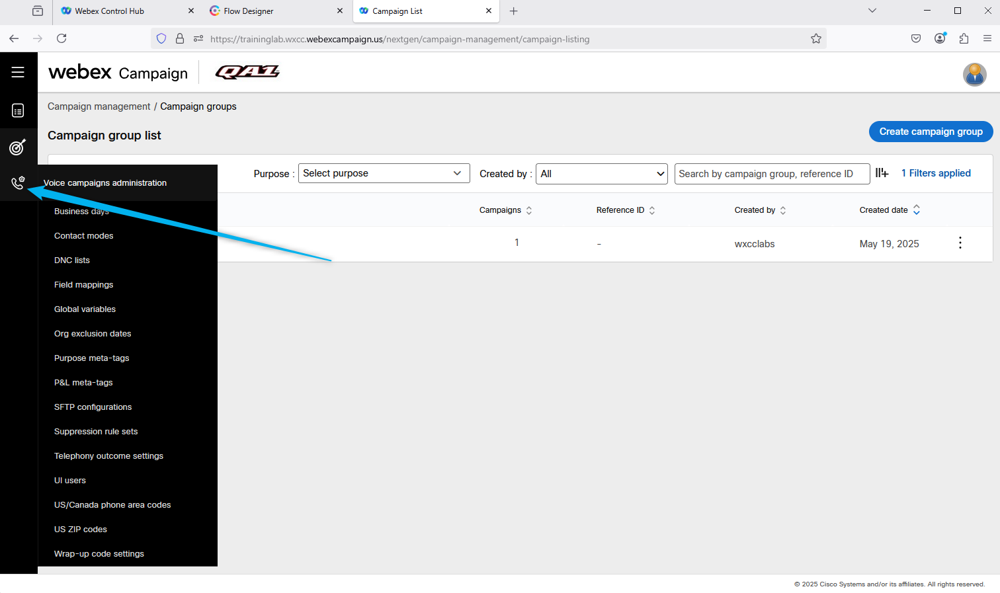 

4. Click on Business Days. You can select the swipe button of the required business day to enable or disable it. The campaign will be paused if it identifies a disabled business day and resumes on the next business day.
   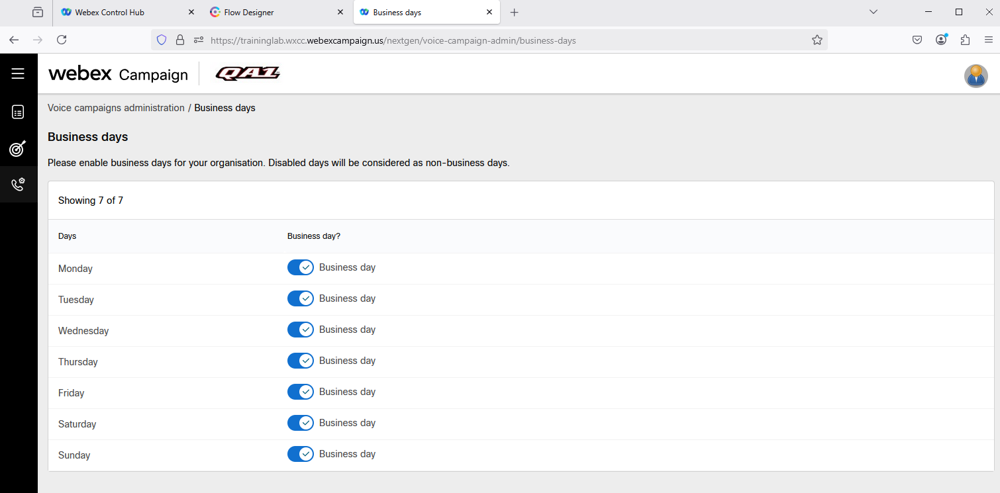 

5. Click on **Contact modes**. You can create different contact modes in Webex Campaign to attribute a particular phone number as a Home or Office numbers.
   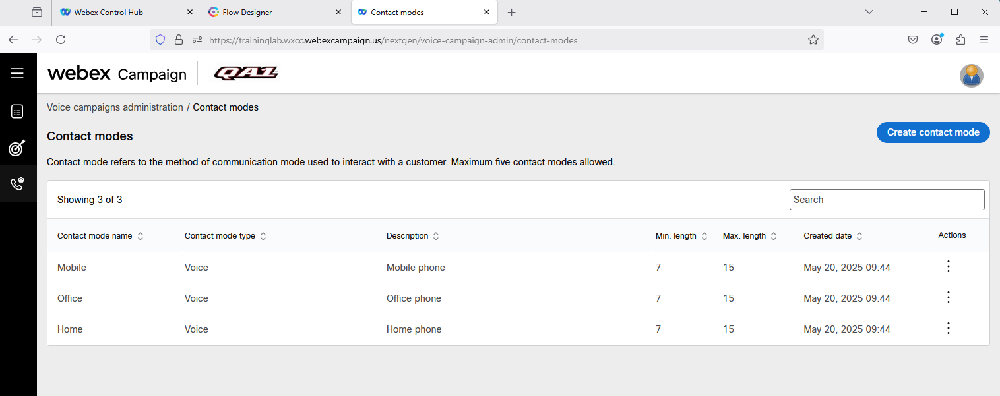 

6. Click on **DNC List**. You create and manage multiple DNC (Do Not Contact) lists. The contacts in DNC lists will be excluded from Target Groups before deploying a campaign. Most commonly, this is used to manage contacts who have registered for DNC with telecom operators.
   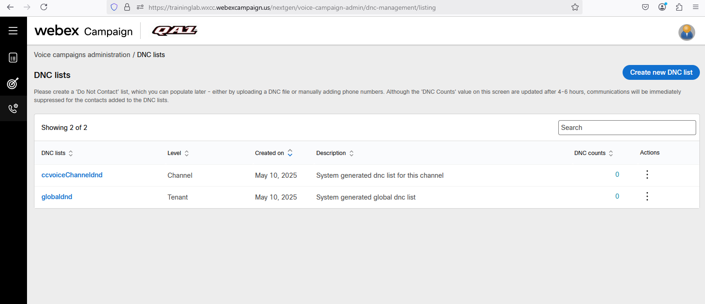 

7. Click on **Field mappings**. This settings refer to the process of uploading a template or sample data and mapping the headers with the headers of dialer system. When you create a campaign, you have to assign the field mappings to a campaign and appropriate contact list has to be uploaded. When you upload a contact list to a campaign, and if the headers of the field mappings do not match, then you will get an error.
    

8. For this lab, **Field Mapping** is preconfigured. However, it is important for you to understand that, during the creation of the field mapping, we assigned the Global Variables to match the headers of the file you will be uploading when managing the campaign list.
   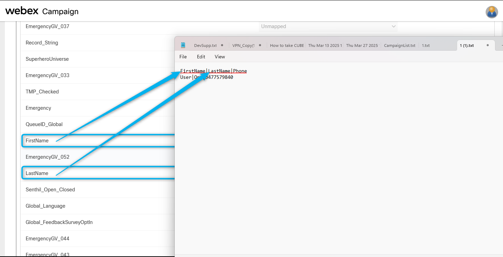 

8. Click on **Global Variable**. These attributes are configured in the control hub application. Webex Campaign will receive these variables from control hub application. At least one variable has to be made a customer unique identifier.
   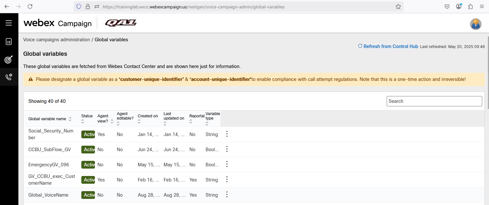 

9. Click on **Purpose meta-tags**. This feature provides a way to separate and maintain the type of campaigns; a user can set up for particular business requirements. During campaign activation, you can tag the campaign with one or more purposes. This allows the enterprise to analyze what type of campaigns they are creating through the platform and helps to maintain a ‘balanced diet’ of communications for contacts.
   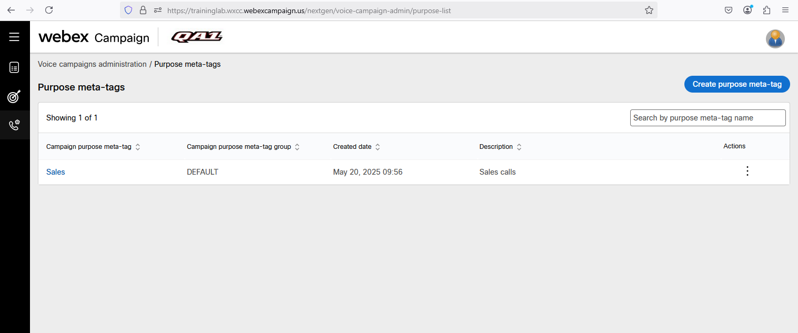 

10. Click on **P&L meta-tags**. This section allows a business to assign a campaign to different divisions, cost centers, or products. For instance, an organization might set up different P&Ls for departments.
    

11. Click on **SFTP configurations**. This section allows you to add SFTP connection details that can be used to access the contact list over SFTP connections.
    

12. Click on **Telephony outcome settings**. These settings refer to the configurations that help define and track the results of calls. These options are configured in the dialer. Webex campaign will receive these outcomes from dialer. They allow businesses to categorize and record the outcome of each call made to a customer. You can edit the outcome to suit your business use case. For example, if the dialer records the outcome as Busy and Close contact - Yes ( do not attempt to call again) can be overwritten in Webex campaign to Close contact - No ( make an attempt to call again).
   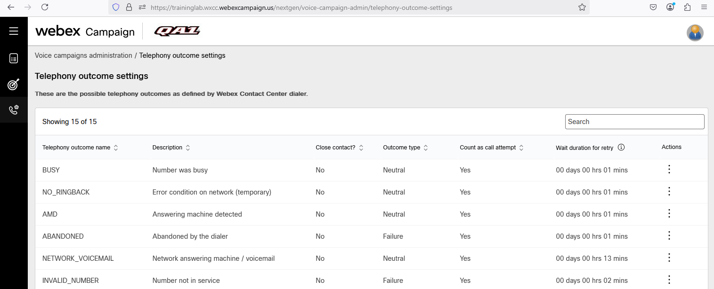

13. While on **Telephony outcome settings** click on Edit of any of them and you will see the how they are configured now. You can customize it per your buisness logic. 
   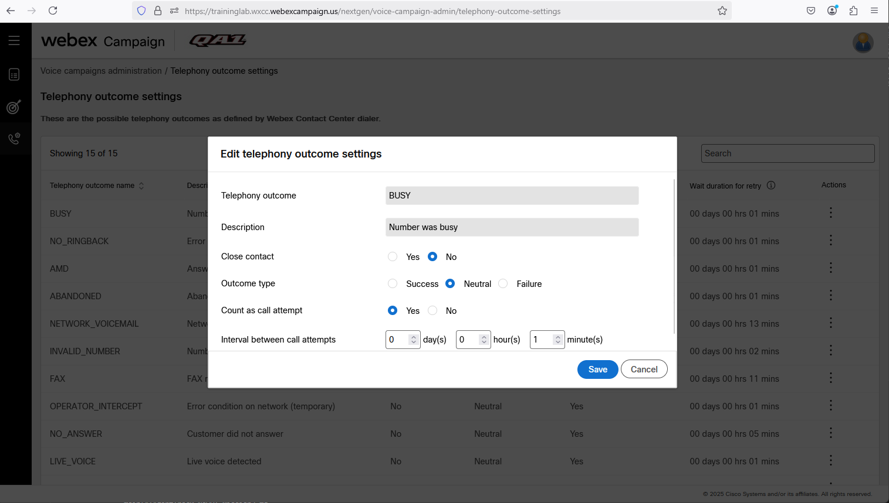

14. Click on **Wrap-up code settings**. These settings refer to the codes that are tagged by the agent after ending the call. They allow businesses to categorize and record the outcome of each call made to a contact. These codes are created in Control Hub.
   

15. Click on Edit any of the Wrap-up code to review how it is configured. 
   

<strong>Congratulations, you have officially completed this mission! 🎉🎉 </strong>
