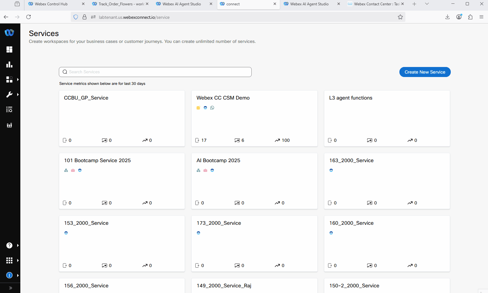
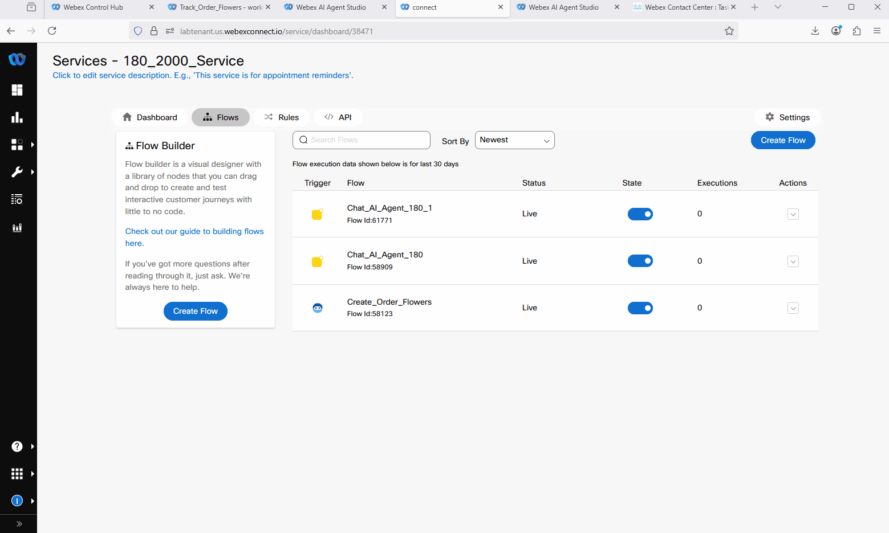
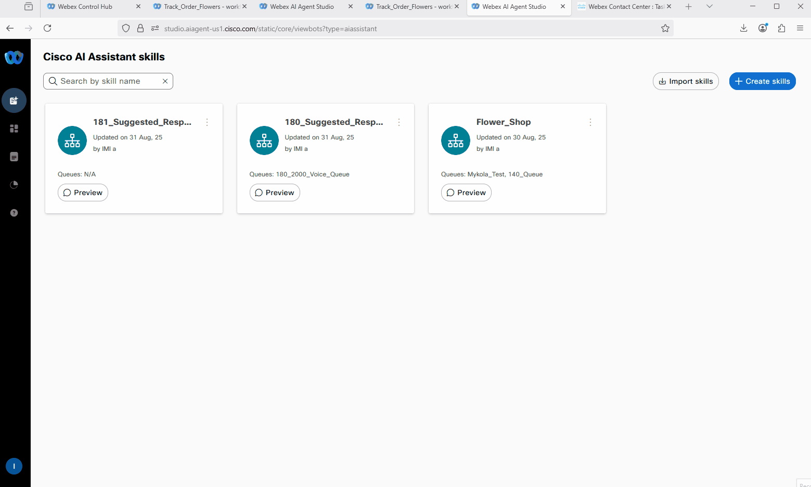

# Mission 2: Configure Fulfillment.

## Mission overview
Your mission is to:

Configure the fulfillment flow to track the status of existing orders. This functionality will allow the system to track the status of an order after the customer provides the order number, so the agent does not have to do any manual work and can simply deliver the order status to the customer. 

---

## Build

### Task 1. Create flow in Webex Connect. 

1. From the Control Hub login to Webex Connect.
    

2. Navigate to the Service that you have created in the previous lab - **<copy><w class="attendee"></w>_Service</copy>**
    

3. Creat new flow. Name it **<copy>Track_Order_Flowers</copy>**.
    

4. Select **Integration** as **AI Agent**. Parse the values in the AI Agent block and **Make Live** the flow. We will configure it in a later Task. For now, we just need to create the flow that will be used to complete the Action Configuration on the AI Studio side.
    

### Task 2. Configure Action in AI Studio portal. 

1. Go to the **AI Studio** portal. 
    

2. Select AI Dashboard and find the **Skill** that you created earlier - **<copy><w class="attendee"></w>_Suggested_Responses_Skill</copy>**.
    

3. Select **Actions** and create new Action. 
    

4. Name the Action as **<copy>track_order</copy>**.  
 
 In the **Action description** provide the following: **<copy>If the customer want to track and order, collect the order number. With the order number execute the fulfillment and return the customer the order status. </copy>**.  
  
  Select the **Action scope** as **Slot filling and fulfillment.** 
    

5. Add **New input entity**. Configure it with the following:  
Name: **<copy>orderNumber</copy>**.  
Entity type: **String**.  
Entiry description: **<copy>If the customer wants to track an order, collect the order number to this entity. </copy>**.  
Entity example: **<copy>17</copy>**.  
Required: **Yes**
    